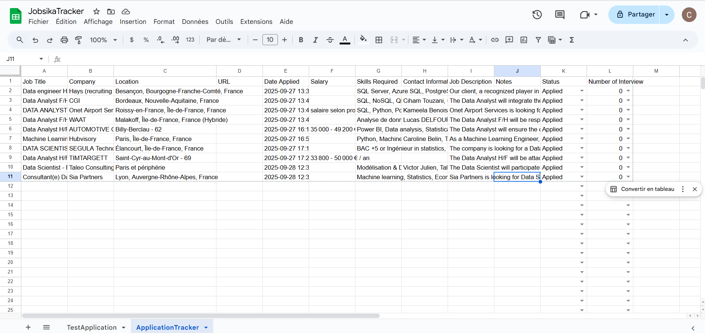
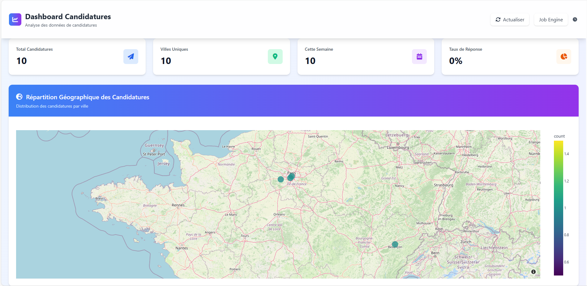
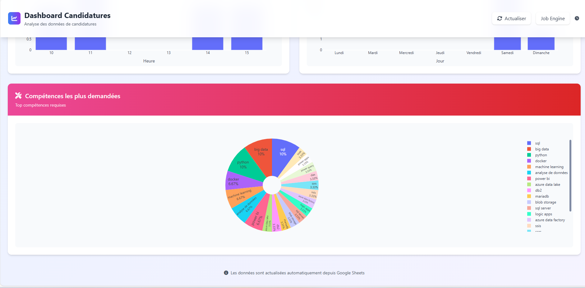

# 🚀 Jobsika  

Jobsika is a tool that helps you track your job applications effortlessly.     
It organizes the data from job descriptions you applied to into Google Sheets. 

You can paste a job description or an url from multiple websites (LinkedIn, Welcome to the Jungle, HelloWork, etc.) and the information will be stored in a Google Sheet.

Jobsika also generates insightful dashboards so you can analyze your job hunt progress, all in one place.  

You can already test the app on [Jobsika](https://jobsika.onrender.com).

## ✨ Features:  

#### 🔍 Automatic Job Data Extraction  

Paste the URL or description of any job posting. Jobsika will extract details like:  

- 🏷️ Job Title
- 🏢 Company
- 📍 Location
- 💰 Salary
- 🛠️ Required Skills

All results are saved into your Google Sheets account under a sheet named JobsikaTracker.  

#### 📊 Report & Dashboard Creation  

Jobsika gives you a clear view of your job search with an interactive dashboard:  

- 📌 Total number of jobs applied
- ✅ Responses vs ❌ Rejections vs 🤐 No replies
- 🗺️ A map showing where you’ve applied

#### 🖼️ Demo & Screenshots

**Example of a JobsikaTracker Google Sheet**

**Map and General Statistics:**  

**Skills asked by the companies in the Job Sheet:**  

#### What Am I working on next :  

🔄 Smart Queue System & Multi-threading
Currently building a robust background processing system that handles multiple job applications simultaneously:

📧 Automated Follow-up System

⏰ 5-7 Day Auto-Follow: Automatically sends polite follow-up messages to hiring managers x days after you apply
